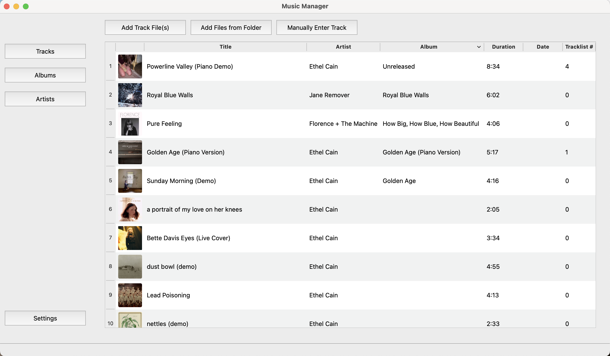
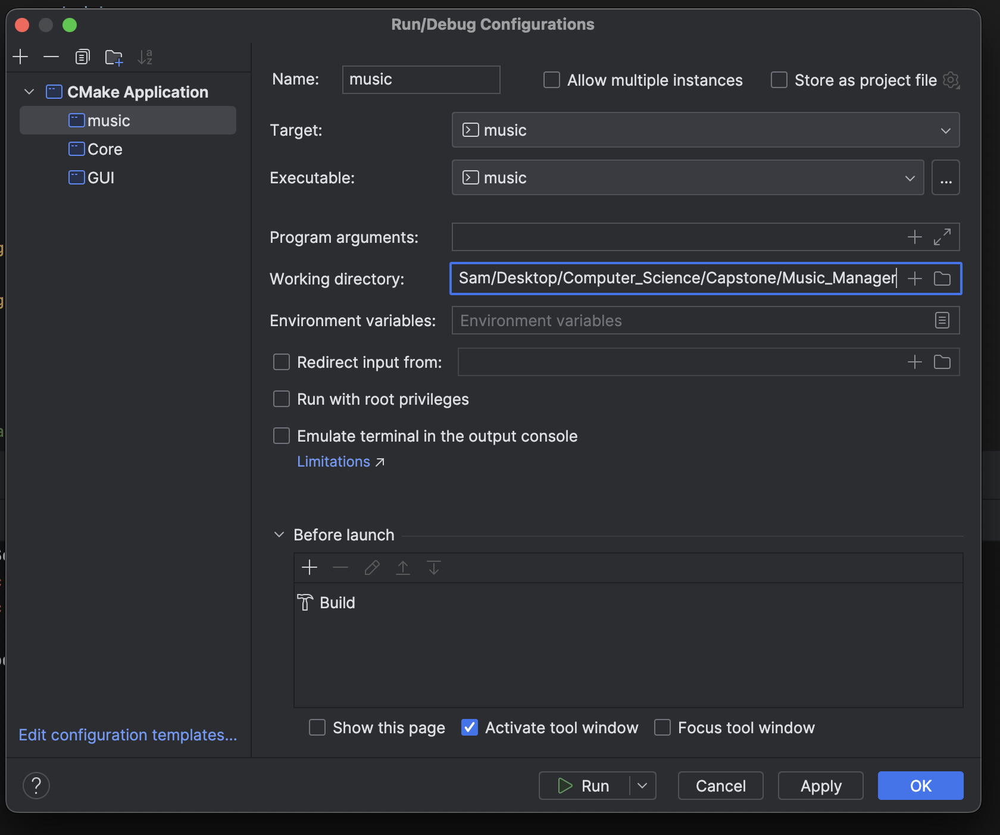
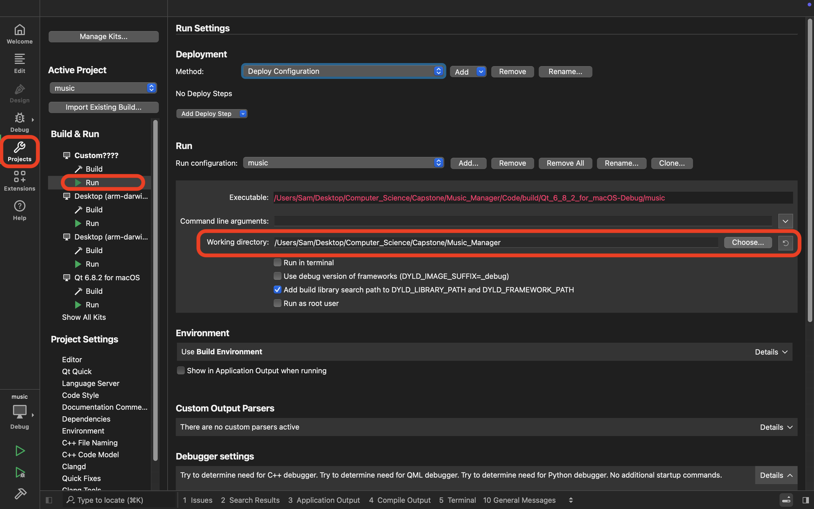

# Music Manager

# Installation

1. Download this project

2. Install libraries (Qt, TagLib, Sqlite3)
    - You can run this if using Homebrew on Mac:
        > `brew install qt taglib sqlite3`

3. Go to the 'Code' folder (which is inside the project folder)
    > `cd Code`

4. Set working directory to 'Music-Manager' or whatever the project folder you downloaded is called
    - If you get the error: `std::runtime_error: unable to open database file` that means your working directory isn't right
        - Program automatically makes database file if doesn't exist, so you only get this error if it's looking in the wrong spot
    - In CLion, set it in the configuration 
        

    - In Qt Creator, it's in *Projects / Run*
        

4. Build & run the project with CMake

# Instructions

## Tracks Page
- ### Add track file(s)
    - Click the *"Add Track File(s)"* button
    - ⌘ `Cmd` + `click` or ⇧ `Shift` + `click`- Select multiple individual files
        - ⌃ `Ctrl` + `click` on Windows
- ### Select track(s)
    - Select 1 track by clicking on it
    - ⇧ `Shift` + `click` - Select multiple contiguous tracks
    - ⌘ `Cmd` + `click` - Select multiple non-contiguous tracks
        - ⌃ `Ctrl` + `click` on Windows
- ### Delete track(s)
    - Select 1 or more tracks, then press ***backspace***
- ### Edit track / open track popup
    - Double click a track in the table to open the track's popup
    - You can edit the track from here
        - Editing the track also edits the file metadata as well
- ### Sort tracks table
    - Click any of the table headers to sort
    - Click again to sort in the opposite direction (either ascending or descending)